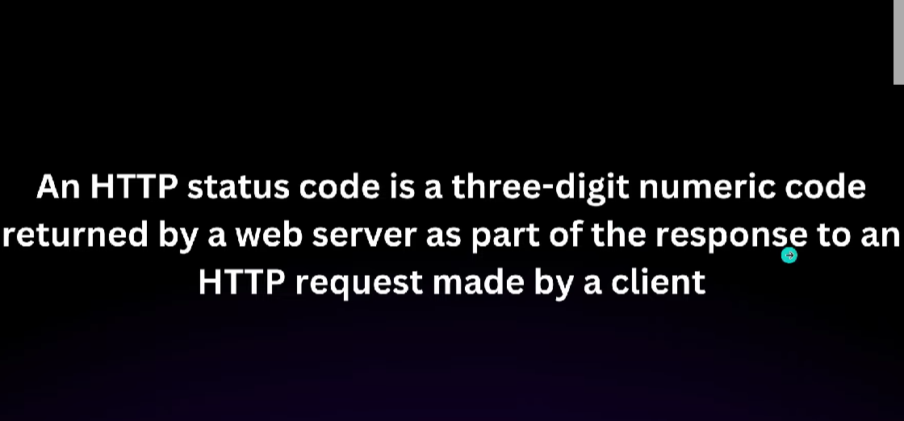
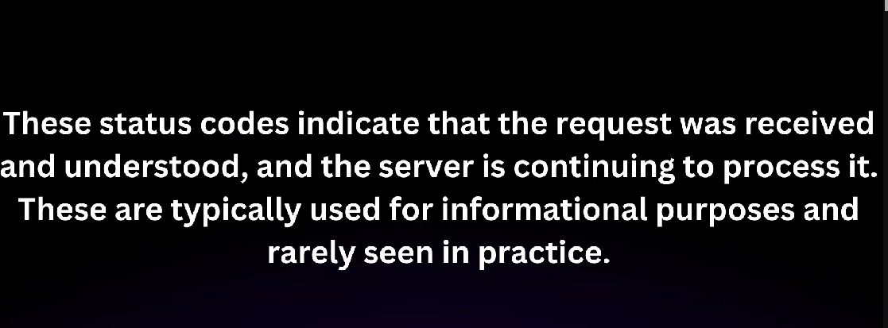
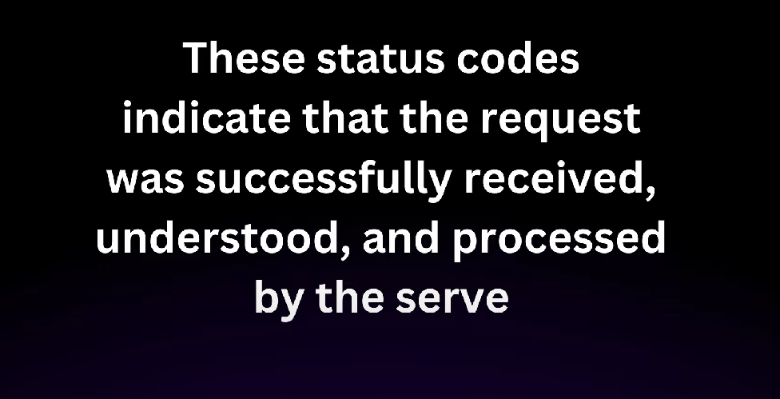
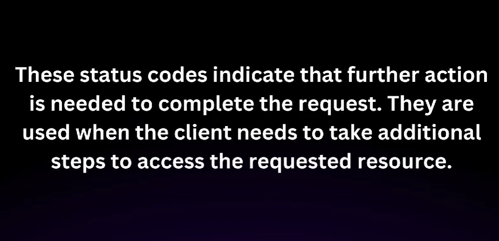
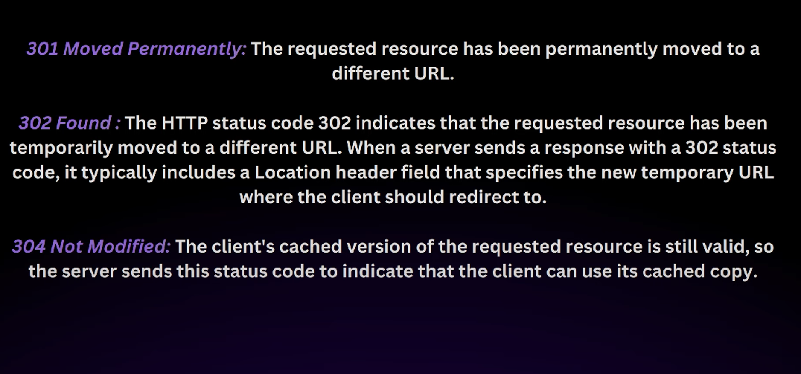
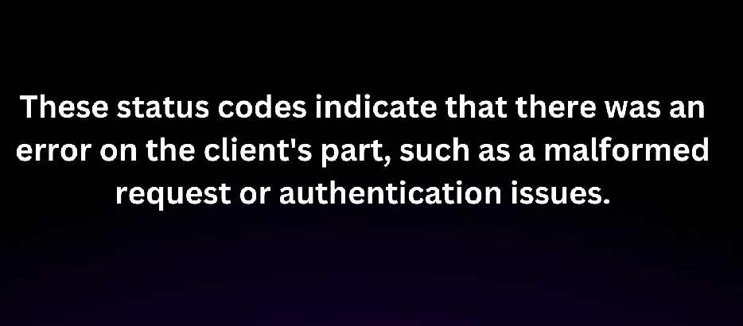
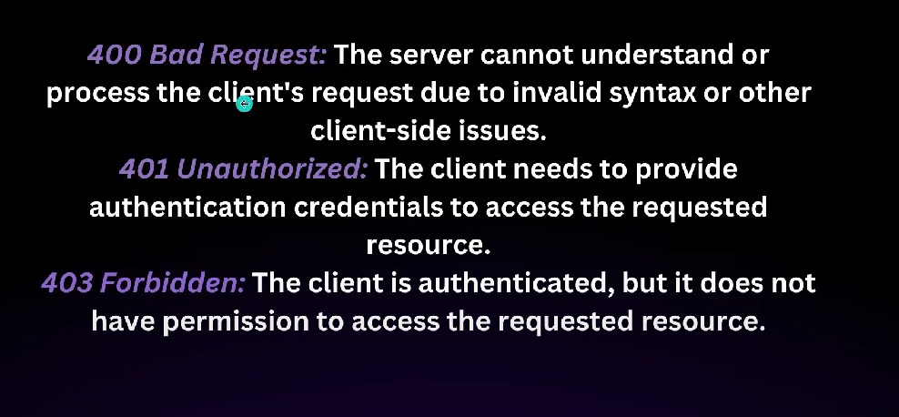
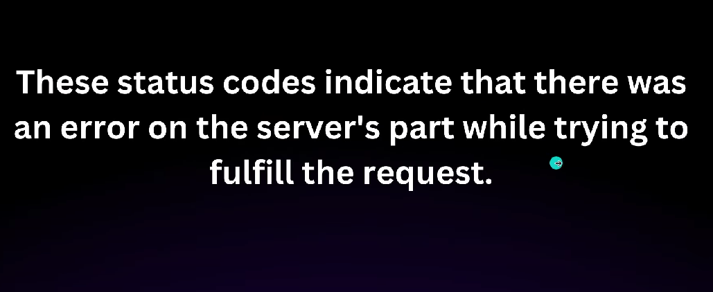
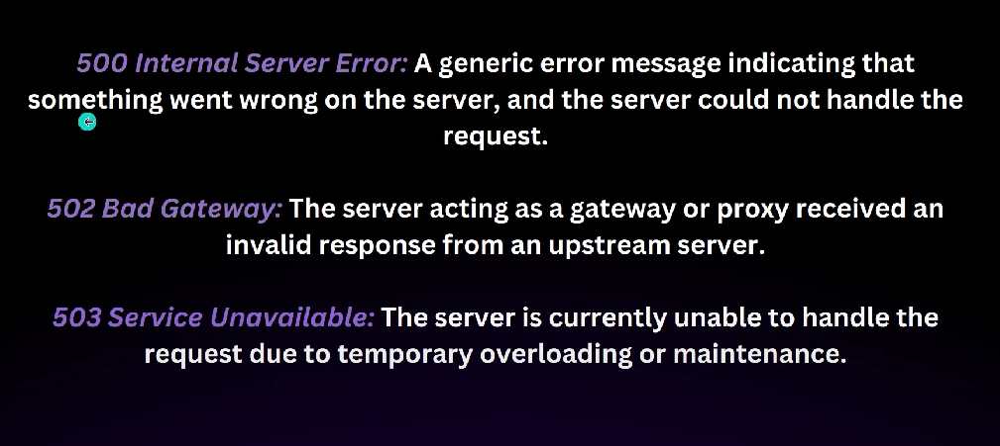

# Spring Data JPA:

## HTTP Status Codes:
 * 1xx(Informational) - 
 *  2xx(Successful) -  
 * Examples - 
 * 3xx(Redirection) - 
 * Examples - 
 * 4xx(Client Error) - 
 * Examples - 
 * 5xx(Server Error) - 
 * Examples - 